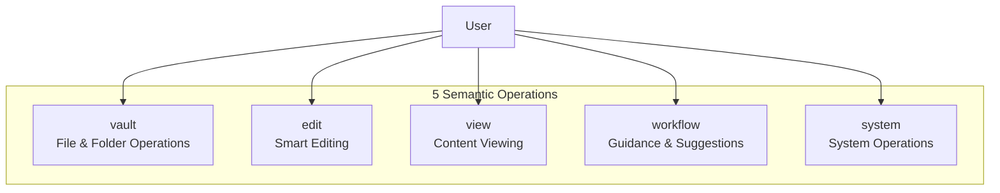
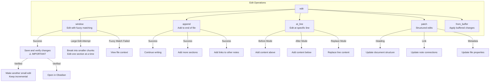
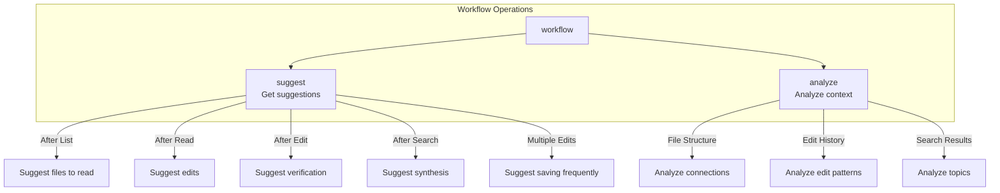
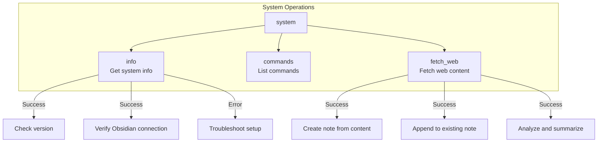
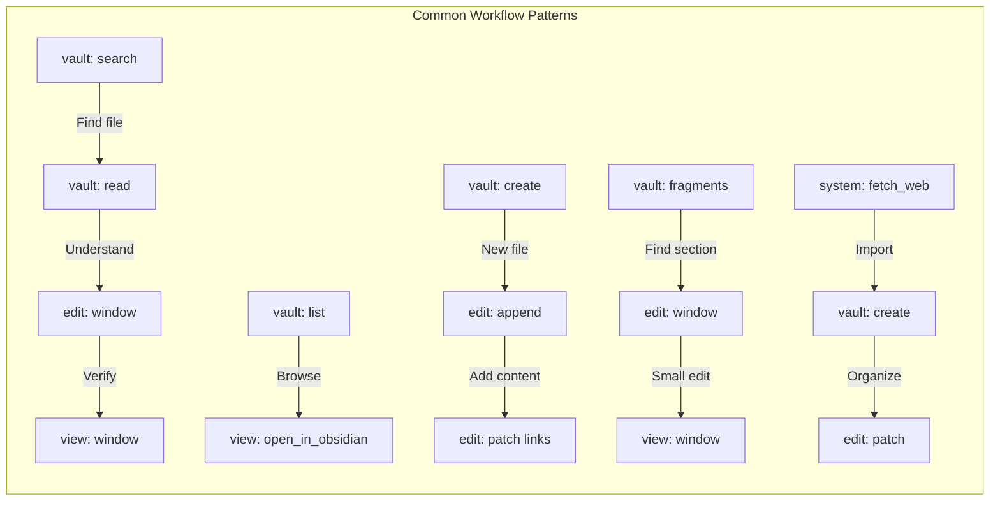
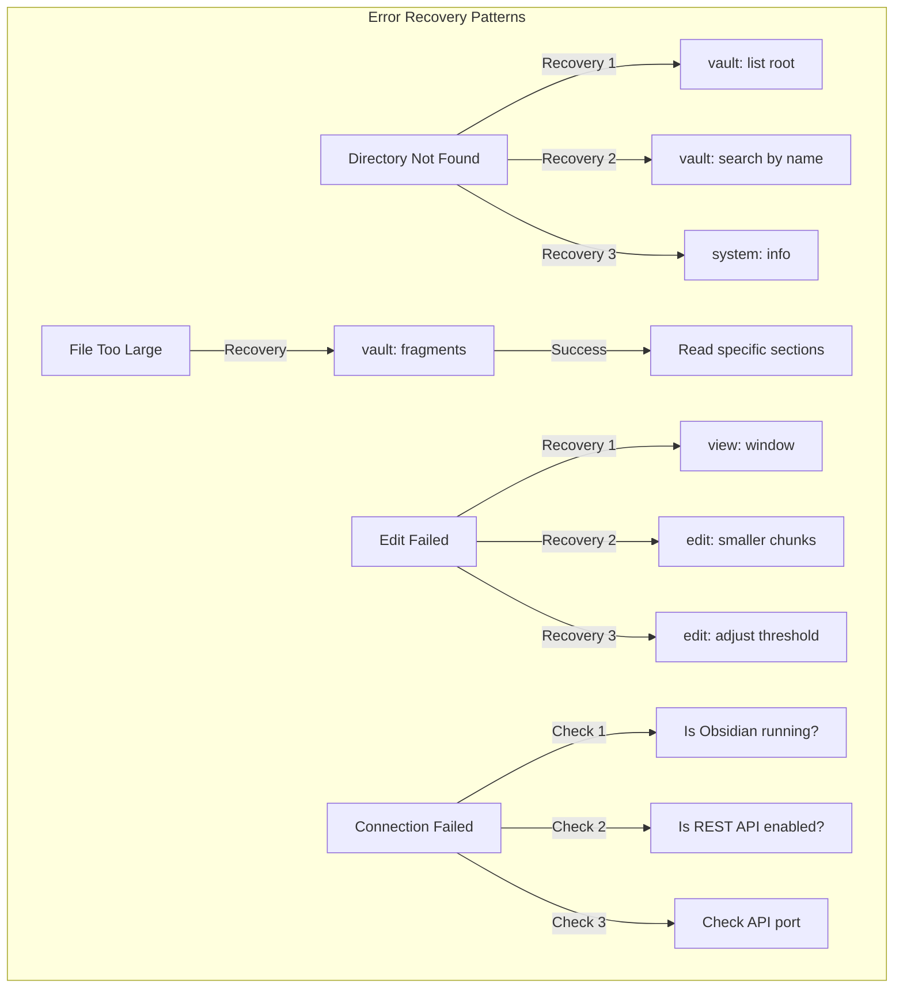
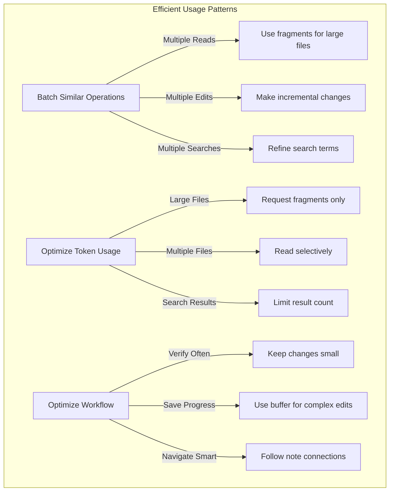
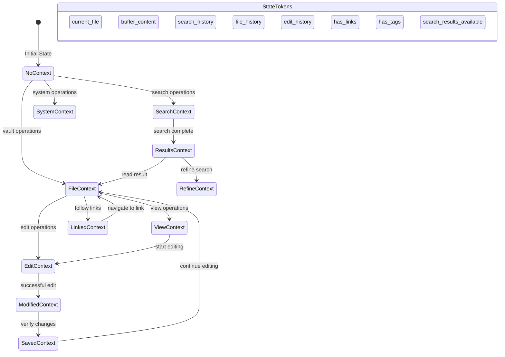

# Obsidian Semantic MCP Tool Flows

This document provides comprehensive mermaid diagrams showing all the ways tools can flow and interact in the Obsidian Semantic MCP server.

## Overview: 5 Semantic Operations

## 1. Vault Operation Flows

```mermaid
graph TD
    subgraph "Vault Operations"
        vault[vault]
        
        %% Actions
        list[list<br/>List files in directory]
        read[read<br/>Read file contents]
        create[create<br/>Create new file]
        update[update<br/>Update file content]
        delete[delete<br/>Delete file]
        search[search<br/>Search vault content]
        fragments[fragments<br/>Get file fragments]
        
        vault --> list
        vault --> read
        vault --> create
        vault --> update
        vault --> delete
        vault --> search
        vault --> fragments
    end
    
    %% List flow
    list -->|Success| read_file[Read specific file]
    list -->|Success| search_dir[Search in directory]
    list -->|404 Error| list_root[List root directory]
    list -->|404 Error| try_parent[Try parent directory]
    list -->|404 Error| search_instead[Search for files]
    list -->|Connection Error| check_system[Check system info]
    
    %% Read flow
    read -->|Has Links| follow_links[Read linked files]
    read -->|Has Tags| search_tags[Search by tags]
    read -->|Success| edit_file[Edit this file]
    read -->|Success| open_obsidian[Open in Obsidian]
    read -->|Large File| use_fragments[Switch to fragments]
    
    %% Create flow
    create -->|Success| add_content[Add content]
    create -->|Success| open_editor[Open in Obsidian]
    create -->|Success| link_from[Link from other notes]
    
    %% Search flow
    search -->|Results| read_result[Read specific result]
    search -->|Results| refine_search[Refine search]
    search -->|Results| create_synthesis[Create synthesis note]
    search -->|Too Many| use_fragments_search[Use fragments for results]
    
    %% Fragments flow
    fragments -->|Success| read_full[Read full file if needed]
    fragments -->|Success| search_specific[Search in specific fragments]
    fragments -->|Success| edit_fragment[Edit specific section]
```

## 2. Edit Operation Flows

## 3. View Operation Flows

```mermaid
graph TD
    subgraph "View Operations"
        view[view]
        
        %% Actions
        file[file<br/>View full file]
        window_view[window<br/>View file section]
        active[active<br/>Get active file]
        open[open_in_obsidian<br/>Open in app]
        
        view --> file
        view --> window_view
        view --> active
        view --> open
    end
    
    %% File view flow
    file -->|Has Content| edit_content[Edit content]
    file -->|Has Links| explore_links[Explore linked notes]
    file -->|Has Tags| find_related[Find related by tags]
    file -->|Too Large| switch_window[Use window view]
    
    %% Window view flow
    window_view -->|Found Text| edit_section[Edit this section]
    window_view -->|Navigation| view_prev[View previous section]
    window_view -->|Navigation| view_next[View next section]
    
    %% Active file flow
    active -->|Success| read_active[Read active content]
    active -->|Success| edit_active[Edit active file]
    active -->|No Active| list_recent[List recent files]
    
    %% Open flow
    open -->|Success| file_opened[File opened in Obsidian]
    open -->|After Search| open_result[Open search result]
    open -->|After Edit| review_changes[Review changes visually]
```

## 4. Workflow Operation Flows

## 5. System Operation Flows

## 6. Cross-Operation Flows

## 7. Error Recovery Flows

## 8. Efficiency Patterns

## 9. State and Context Flow

## Usage Guide

### For AI Agents

1. **Always verify edits**: After using `edit`, use `view` to verify changes
2. **Keep edits small**: Make incremental changes, save frequently
3. **Use fragments for large files**: Prevents token overflow
4. **Follow workflow hints**: The system provides context-aware suggestions
5. **Handle errors gracefully**: Use recovery hints when operations fail

### For Developers

1. **Semantic operations**: Think in terms of the 5 main operations
2. **Context awareness**: The system maintains state across operations
3. **Efficiency rules**: Built-in patterns prevent common inefficiencies
4. **Error recovery**: Every error includes actionable recovery steps
5. **Fragment retrieval**: Automatic for large files, configurable strategies

### Best Practices

1. **Search before reading**: Use search to find relevant files first
2. **Fragment before full read**: For files >5000 tokens, use fragments
3. **Incremental editing**: Make small changes and verify each one
4. **Follow the hints**: Workflow suggestions are context-aware
5. **Use the right tool**: Each operation has an optimal use case